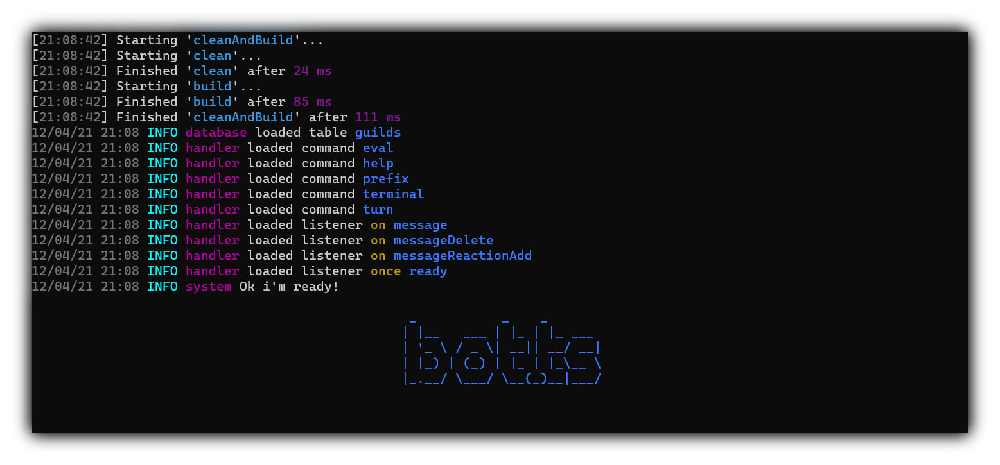

# Introduction

## What is bot.ts ?

**bot.ts** is a framework for [discord.js](https://discord.js.org/#/) designed in TypeScript for use in TypeScript. This framework includes all the features you need, here is a list:

* Advanced handler. \(for commands and listeners\)
* [CLI](https://www.npmjs.com/package/make-bot.ts) to generate command and listener files.
* Very practical file structure. \(all the app parts are includes and exported from [app.ts](https://github.com/CamilleAbella/bot.ts/blob/master/src/app.ts)\)
* [Yargs](http://yargs.js.org/) based argument system for commands.
* Some essential [commands](https://github.com/CamilleAbella/bot.ts/blob/master/src/commands) and [listeners](https://github.com/CamilleAbella/bot.ts/blob/master/src/listeners). \(including an advanced "eval" command\)
* Some scripts in [package.json](https://github.com/CamilleAbella/bot.ts/blob/master/package.json). \(including a TypeScript watcher\)
* [Knex](http://knexjs.org/) database provider [here](https://github.com/CamilleAbella/bot.ts/blob/master/src/app/database.ts), configured by default with [sqlite3](https://www.npmjs.com/package/sqlite3).
* Efficient [pagination](https://github.com/CamilleAbella/bot.ts/blob/master/src/app/pagination.ts) system. \(example in [help](https://github.com/CamilleAbella/bot.ts/blob/master/src/commands/help.ts#L108) command\)
* [ESBuild](https://esbuild.github.io) configuration for a build faster than 100ms

## Why using bot.ts ?

Code faster and without the hassle. Choosing **bot.ts** is choosing control.

* It's not a lib! You can edit all files easly.
* All is already configured.
* I recommend it for learning TypeScript.
* It uses ESBuild for boosted productivity

## Annexes

* [GitHub repository](https://github.com/CamilleAbella/bot.ts)
* [CLI on NPN](https://www.npmjs.com/package/make-bot.ts)
* [Discord server](https://discord.gg/3vC2XWK)

