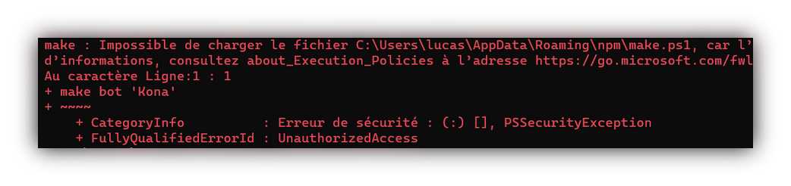

# Troubleshooting

## PSSecurityException

When using the CLI, your console displays an error of type **PSSecurityException**. \(picture attached\)



### Fix PSSecurityException

Open your **PowerShell** **as administrator** and simply enter the following command.

```bash
set-executionpolicy remotesigned
```

